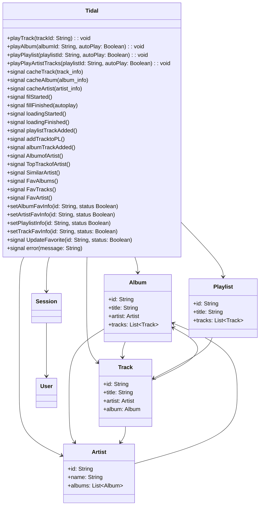
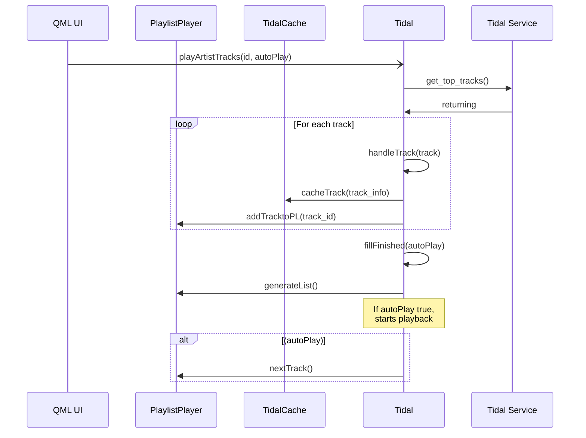
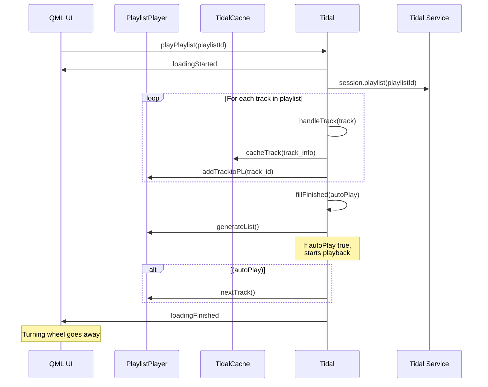

# General
tidal.py is the python implementation
TidalApi.qml is the qml proxy, so to say. It uses pythonotherside to call methods in tidal.py and defines the handlers for python signals.
tidal.py sends signals via pythonotherside, TidalApi handles them and sends qt signals

# Class diagrams
the class diagrams are simplified. Tidal Service represents the Tidal service incl. python-tidal client.
TidalApi.qml is ignored.
Tidal represents class Tidal as defined in tidal.py 

# Sequence diagrams
Sequence diagrams are simplified. They do not show the pythonotherside layer with signal-handlers.

## playArtistTracks sequence diagram
id: artistID

autoPlay: start playing after load

applicable to:
- playAlbumTracks
- playAlbumfromTrack
- playArtistTracks

## playPlaylist sequence diagram

https://sidharthv96.github.io/mermaid/syntax/sequenceDiagram.html